<div align="center">

# Remote Kit - Smart Remote Config SDK

<br />


<br />
<br />

</div>

Remote Kit is a lightweight Remote Config platform that allows mobile applications to fetch dynamic UI and behavior configurations from a central server, without releasing a new app version.

The system includes:

* Android SDK integration
* Web-based admin portal
* Node.js + Express backend
* MongoDB database
* Server-side targeting rules
* A/B testing support
* Analytics dashboard
* Audit logs and rollback
* Optimized server cache and database indexing

---

## Table of Contents

* [Demo Video](#demo-video)
* [Documentation](#documentation)
* [Screenshots](#screenshots)
* [Features](#features)
  * [Remote Config Management](#remote-config-management)
  * [Android SDK](#android-sdk)
  * [Targeting Rules](#targeting-rules)
  * [A/B Testing](#ab-testing)
  * [Analytics Dashboard](#analytics-dashboard)
  * [Audit Logs and Rollback](#audit-logs-and-rollback)
  * [Server Optimization](#server-optimization)
* [Tech Stack](#tech-stack)
* [Project Structure](#project-structure)
* [System Architecture](#system-architecture)
* [Application Models](#application-models)
* [Database Design](#database-design)
  * [Main Collections](#main-collections)
  * [ERD](#erd)
  * [Database Collections](#database-collections)
* [Server Efficiency](#server-efficiency)
  * [1. In-Memory Cache](#1-in-memory-cache)
  * [2. Batched Device Sync Writes](#2-batched-device-sync-writes)
  * [3. Daily Analytics Counters](#3-daily-analytics-counters)
  * [4. MongoDB Indexes](#4-mongodb-indexes)
  * [5. `lean()` for Faster Reads](#5-lean-for-faster-reads)
  * [6. Compression](#6-compression)
* [SDK Network Sequence Diagram](#sdk-network-sequence-diagram)
* [Publish Sequence Diagram](#publish-sequence-diagram)
* [State Diagram - Config Lifecycle](#state-diagram---config-lifecycle)
* [API Endpoints](#api-endpoints)
  * [Public SDK Endpoints](#public-sdk-endpoints)
  * [Private Admin Portal Endpoints](#private-admin-portal-endpoints)
* [JSON Snippets](#json-snippets)
* [Android SDK Implementation](#android-sdk-implementation)
* [Using the Project](#using-the-project)
  * [Prerequisites](#prerequisites)
  * [Server Setup](#server-setup)
  * [Portal Setup](#portal-setup)
  * [Android Setup](#android-setup)
* [Main Server Functions](#main-server-functions)
  * [Public Functions](#public-functions)
  * [Private Portal Functions](#private-portal-functions)
  * [Internal Helper Functions](#internal-helper-functions)
* [Dashboard Features](#dashboard-features)
* [Network Flow](#network-flow)
* [Performance Summary](#performance-summary)
* [Future Improvements](#future-improvements)
* [License](#license)

---

## Demo Video
<p align="center">
  <a href="https://youtu.be/Yzva4QEaMMQ" target="_blank">
    
  </a>
</p>

---

## Documentation

The full project documentation is available on the GitHub Pages website.

<p align="center">
  <a href="https://rotemgilboa2.github.io/RemoteConfigSDK/">
    
  </a>
</p>

---

## Screenshots

All screenshots are located under `docs/assets/images`.

### App and Portal Screens

<table>
  <tr>
    <td align="center">
      <strong>Login Screen</strong>
      <br />
      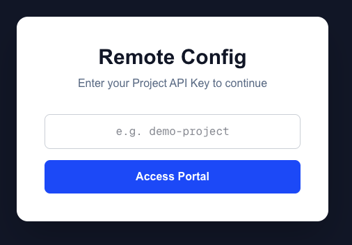
    </td>
    <td align="center">
      <strong>Main Dashboard</strong>
      <br />
      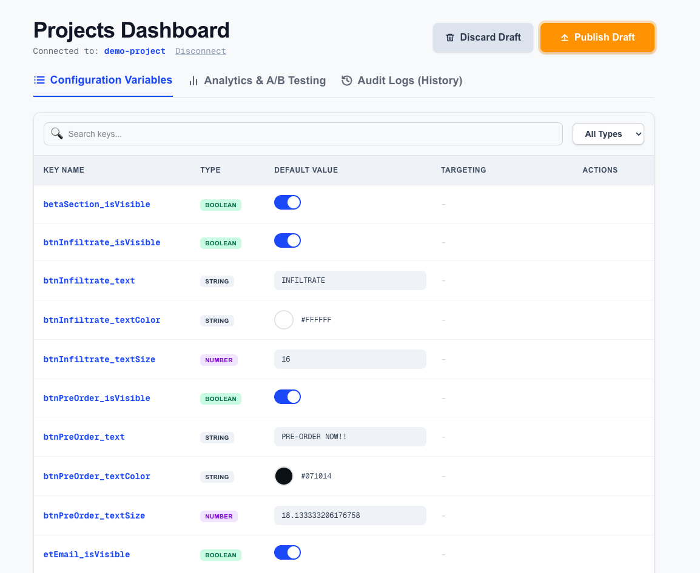
    </td>
  </tr>
  <tr>
    <td align="center">
      <strong>Edit Configuration</strong>
      <br />
      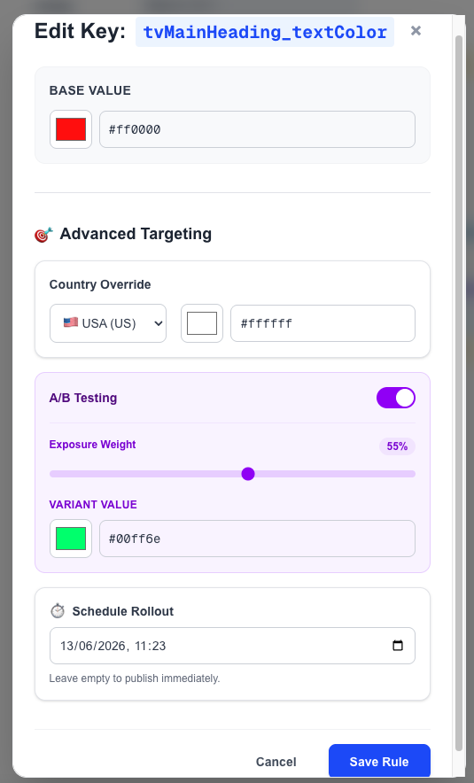
    </td>
    <td align="center">
      <strong>A/B Testing Graphs</strong>
      <br />
      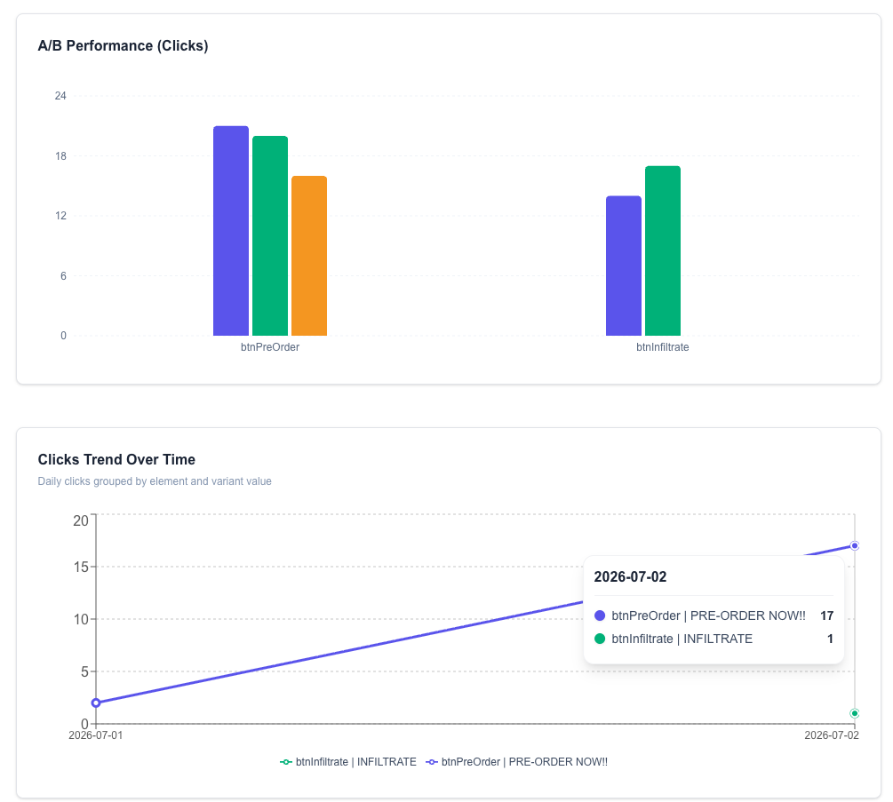
    </td>
  </tr>
</table>

### Analytics Dashboard

<div align="center">
  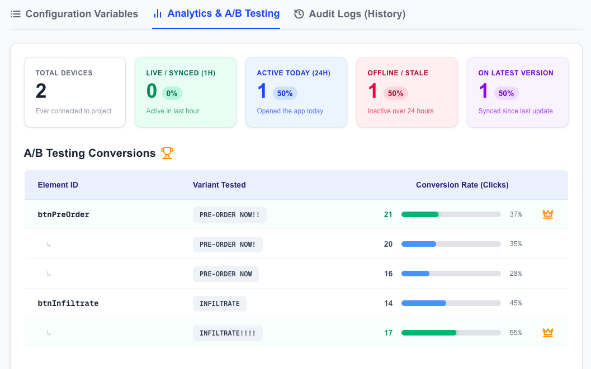
</div>

---

## Features

### Remote Config Management

* Create and manage dynamic configuration keys.
* Supports multiple data types:

  * `String`
  * `Number`
  * `Boolean`
  * `JSON`
* Update values from the web portal.
* Publish changes live.
* Discard draft changes before publishing.

### Android SDK

* Simple SDK initialization.
* Fetches configs from the server.
* Automatically applies remote values to Android views.
* Automatically registers UI elements into the portal.
* Supports refresh on app resume.

### Targeting Rules

* Global default value.
* Country-based override.
* Scheduled rollout.
* A/B testing by percentage.

### A/B Testing

* Assigns users to control or test group.
* Tracks clicks by:

  * `projectId`
  * `elementId`
  * `variantValue`
* Shows winning variant based on click count.
* Allows applying winning variant to all users.

### Analytics Dashboard

* Total connected devices.
* Devices active in the last hour.
* Devices active in the last 24 hours.
* Devices synced since last update.
* A/B click conversion table.
* Clicks trend over time.
* Activity heatmap.
* Live connected devices.

### Audit Logs and Rollback

* Saves every meaningful config change.
* Shows history of changes.
* Allows rollback to previous value.
* Clears server cache after rollback so SDK receives fresh values.

### Server Optimization

* In-memory project cache.
* Cache invalidation after publish, delete, rollback and winner selection.
* Batched device sync writes using `bulkWrite`.
* Daily analytics counters instead of saving every click event.
* MongoDB indexes for common dashboard queries.
* Response compression using `compression`.

---

## Tech Stack

| Layer        | Technology                                        |
| ------------ | ------------------------------------------------- |
| Android App  | Kotlin, Android Studio                            |
| SDK          | Kotlin                                            |
| Admin Portal | Next.js, React, TypeScript, TailwindCSS, Recharts |
| Backend      | Node.js, Express.js                               |
| Database     | MongoDB                                           |
| ODM          | Mongoose                                          |
| Charts       | Recharts                                          |
| API Format   | REST + JSON                                       |

---

## Project Structure

```txt
smart-remote-config/
│
├── server/
│   ├── server.js
│   ├── package.json
│   └── .env
│
├── portal/
│   ├── app/
│   │   ├── Dashboard.tsx
│   │   └── EditModal.tsx
│   ├── package.json
│   └── next.config.js
│
├── android/
│   ├── app/
│   └── remoteconfig-sdk/
│
└── README.md
```

---

# System Architecture

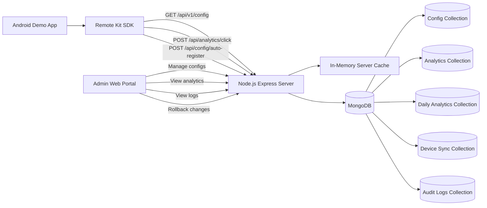

---

# Application Models

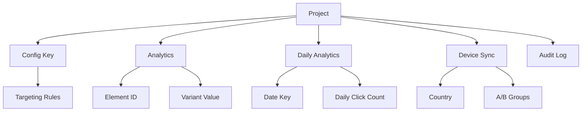

---

# Database Design

The database is designed around `projectId`, which separates all data by project.

## Main Collections

| Collection       | Purpose                                          |
| ---------------- | ------------------------------------------------ |
| `configs`        | Stores remote config keys and targeting rules    |
| `analytics`      | Stores total click count per element and variant |
| `dailyanalytics` | Stores daily click counters for trend charts     |
| `devicesyncs`    | Stores active device sync data                   |
| `auditlogs`      | Stores config change history and rollback data   |

---

## ERD

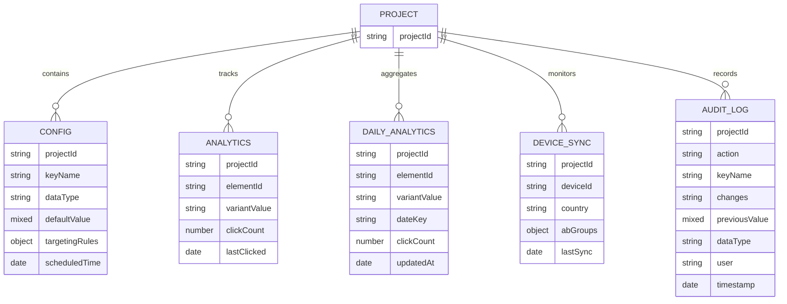

---

## Database Collections

### Config Collection

Stores the remote configuration keys.

```js
{
  projectId: "demo-project",
  keyName: "btnPreOrder_text",
  dataType: "String",
  defaultValue: "Pre Order",
  targetingRules: {
    country: "IL",
    countryValue: "הזמן עכשיו",
    abTestEnabled: true,
    abTestPercentage: 50,
    abTestVariantValue: "Buy Now"
  },
  scheduledTime: null
}
```

### Analytics Collection

Stores total clicks for each element and variant.

```js
{
  projectId: "demo-project",
  elementId: "btnPreOrder",
  variantValue: "Buy Now",
  clickCount: 24,
  lastClicked: "2026-07-01T10:00:00.000Z"
}
```

### Daily Analytics Collection

Stores daily counters instead of saving every click event.

```js
{
  projectId: "demo-project",
  elementId: "btnPreOrder",
  variantValue: "Buy Now",
  dateKey: "2026-07-01",
  clickCount: 8
}
```

### Device Sync Collection

Stores latest sync data per device.

```js
{
  projectId: "demo-project",
  deviceId: "device-123",
  country: "IL",
  abGroups: {
    btnPreOrder_text: "Variant B (Test Group)"
  },
  lastSync: "2026-07-01T10:00:00.000Z"
}
```

### Audit Log Collection

Stores history for rollback and traceability.

```js
{
  projectId: "demo-project",
  action: "Updated Rule",
  keyName: "btnPreOrder_text",
  changes: "Changed value to [Buy Now]",
  previousValue: "Pre Order",
  dataType: "String",
  user: "Admin"
}
```

---

# Server Efficiency

The server was designed to reduce unnecessary database access and handle frequent SDK calls efficiently.

## 1. In-Memory Cache

The SDK config endpoint is the most important endpoint because every app can call it.

Instead of reading from MongoDB on every request, the server keeps project configs in memory:

```js
const serverCache = {};
```

Flow:

1. First request for project config.
2. Server reads configs from MongoDB.
3. Server stores configs in memory by `projectId`.
4. Next SDK requests are served from memory.
5. Cache is deleted only when the project changes.

Cache is invalidated after:

* Publish
* Delete config
* Rollback
* Auto-register new elements

This improves performance because most SDK reads do not hit MongoDB.

---

## 2. Batched Device Sync Writes

Device sync updates can happen often. Instead of writing every sync immediately to MongoDB, the server keeps updates in a buffer:

```js
const syncDevicesBuffer = new Map();
```

Every 10 seconds, the server writes all pending device updates using `bulkWrite`.

This reduces many small database writes into one efficient batch operation.

---

## 3. Daily Analytics Counters

A naive analytics system stores every click as a separate document.

Remote Kit uses a more efficient approach:

```txt
projectId + elementId + variantValue + dateKey
```

Each click increments a daily counter using `$inc`.

Benefits:

* Smaller database size
* Faster trend queries
* Less write overhead
* Still supports daily charts

---

## 4. MongoDB Indexes

Indexes are added according to the dashboard query patterns.

Recommended indexes:

```js
configSchema.index({ projectId: 1, keyName: 1 });

analyticsSchema.index(
  { projectId: 1, elementId: 1, variantValue: 1 },
  { unique: true }
);

analyticsSchema.index({ projectId: 1, lastClicked: -1 });

dailyAnalyticsSchema.index(
  { projectId: 1, elementId: 1, variantValue: 1, dateKey: 1 },
  { unique: true }
);

dailyAnalyticsSchema.index({
  projectId: 1,
  dateKey: 1,
  elementId: 1,
  variantValue: 1
});

deviceSyncSchema.index(
  { projectId: 1, deviceId: 1 },
  { unique: true }
);

deviceSyncSchema.index({ projectId: 1, lastSync: -1 });

auditLogSchema.index({ projectId: 1, timestamp: -1 });
```

Why these indexes matter:

| Query                                    | Index                                             |
| ---------------------------------------- | ------------------------------------------------- |
| Find configs by project                  | `{ projectId, keyName }`                          |
| Find analytics and sort by recent clicks | `{ projectId, lastClicked }`                      |
| Find active devices by last sync         | `{ projectId, lastSync }`                         |
| Fetch audit logs by newest first         | `{ projectId, timestamp }`                        |
| Build daily charts                       | `{ projectId, dateKey, elementId, variantValue }` |

---

## 5. `lean()` for Faster Reads

For read-only queries, `lean()` returns plain JavaScript objects instead of heavy Mongoose documents.

Example:

```js
const dbConfigs = await ConfigModel.find({ projectId }).lean();
```

This improves performance for API responses that do not need document methods.

---

## 6. Compression

The server uses response compression:

```js
app.use(compression());
```

This reduces payload size for dashboard responses and config responses.

---

# SDK Network Sequence Diagram

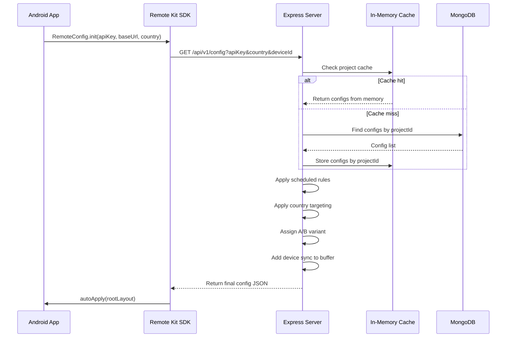

---

# Publish Sequence Diagram

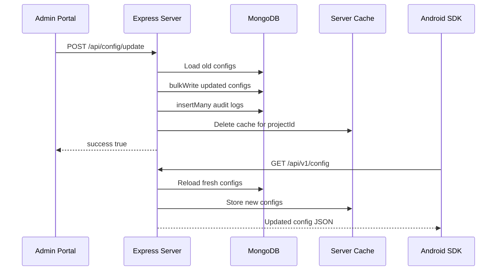

---

# State Diagram - Config Lifecycle

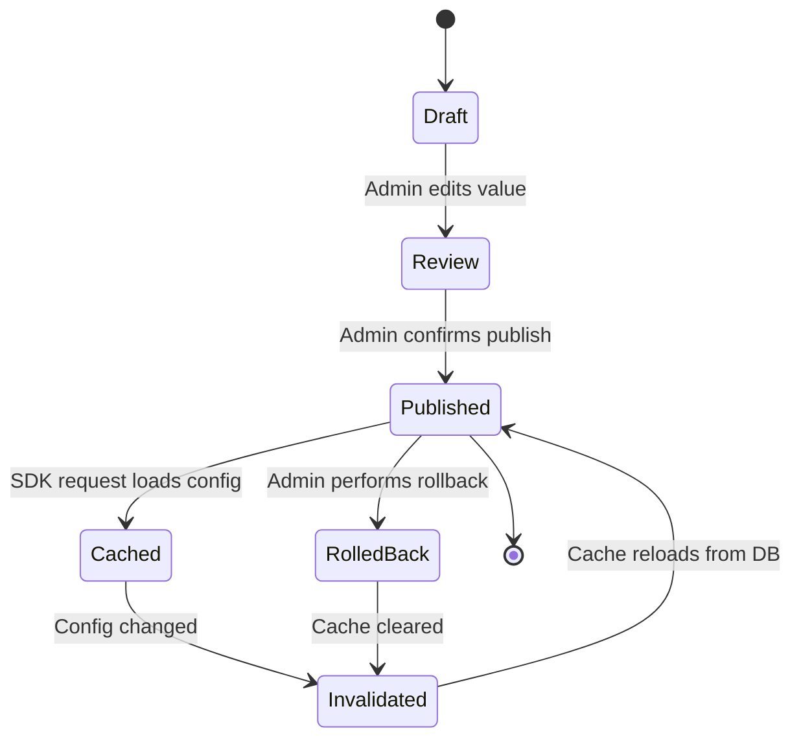

---


# API Endpoints

## Public SDK Endpoints

These endpoints are used by the Android SDK.

| Method | Endpoint                    | Description                   |
| ------ | --------------------------- | ----------------------------- |
| `GET`  | `/api/v1/config`            | Fetch remote configs for SDK  |
| `POST` | `/api/analytics/click`      | Track click analytics         |
| `POST` | `/api/config/auto-register` | Register UI elements from app |

## Private Admin Portal Endpoints

These endpoints are used by the web dashboard.

| Method   | Endpoint                                | Description                     |
| -------- | --------------------------------------- | ------------------------------- |
| `GET`    | `/api/config/portal/:projectId`         | Get all configs for portal      |
| `POST`   | `/api/config/update`                    | Publish updated configs         |
| `DELETE` | `/api/config`                           | Delete config key               |
| `GET`    | `/api/analytics/:projectId`             | Get total analytics             |
| `GET`    | `/api/analytics/time-series/:projectId` | Get daily analytics and heatmap |
| `GET`    | `/api/health/:projectId`                | Get device health stats         |
| `GET`    | `/api/devices/:projectId`               | Get active devices              |
| `POST`   | `/api/logs`                             | Create audit log                |
| `GET`    | `/api/logs/:projectId`                  | Get audit logs                  |
| `POST`   | `/api/config/rollback`                  | Rollback config value           |
| `GET`    | `/api/analytics/ab-insights/:projectId` | Get A/B test insights           |

---

# JSON Snippets

## Fetch Config Response

```json
{
  "configs": {
    "btnPreOrder_text": "Buy Now",
    "hero_title_text": "Remote Config Updated",
    "betaSection_isVisible": true
  }
}
```

## Track Click Request

```json
{
  "projectId": "demo-project",
  "elementId": "btnPreOrder",
  "variantValue": "Buy Now"
}
```

## Publish Config Request

```json
{
  "configsToSave": [
    {
      "projectId": "demo-project",
      "keyName": "btnPreOrder_text",
      "dataType": "String",
      "defaultValue": "Buy Now"
    }
  ]
}
```

## Auto Register Request

```json
{
  "projectId": "demo-project",
  "elements": [
    {
      "id": "btnPreOrder",
      "text": "Pre Order",
      "bgColor": "#6366f1"
    }
  ]
}
```

## Analytics Time Series Response

```json
{
  "success": true,
  "timeSeries": [
    {
      "_id": {
        "date": "2026-07-01",
        "element": "btnPreOrder",
        "variantValue": "Buy Now"
      },
      "totalClicks": 12
    }
  ]
}
```

---

# Android SDK Implementation

## 1. Initialize Remote Kit

```kotlin
RemoteConfig.init(
    context = applicationContext,
    apiKey = "demo-project",
    baseUrl = "http://192.168.1.115:3001",
    country = "IL",
    listener = object : RemoteConfig.Listener {
        override fun onReady() {
            runOnUiThread {
                RemoteConfig.autoApply(rootLayout)
                RemoteConfig.autoRegisterViews(rootLayout)
            }
        }

        override fun onError(message: String) {
            Toast.makeText(this@MainActivity, "SDK Error: $message", Toast.LENGTH_LONG).show()
        }
    }
)
```

## 2. Refresh Configs

```kotlin
RemoteConfig.refresh(listener = object : RemoteConfig.Listener {
    override fun onReady() {
        runOnUiThread {
            RemoteConfig.autoApply(rootLayout)
        }
    }

    override fun onError(message: String) {
        Log.e("MainActivity", "Failed to refresh: $message")
    }
})
```

## 3. Apply Configs Automatically

```kotlin
RemoteConfig.autoApply(rootLayout)
```

The SDK scans the Android view hierarchy and applies remote values to matching view IDs.

Example mapping:

```txt
btnPreOrder_text      -> Button text
btnPreOrder_bgColor   -> Button background color
btnPreOrder_textColor -> Button text color
betaSection_isVisible -> View visibility
```

## 4. Register Views Automatically

```kotlin
RemoteConfig.autoRegisterViews(rootLayout)
```

This sends detected UI elements to the portal so the admin can manage them remotely.

For production optimization, this should be limited to debug mode or only sent when the screen structure changes.

```kotlin
if (BuildConfig.DEBUG) {
    RemoteConfig.autoRegisterViews(rootLayout)
}
```

---

# Using the Project

## Prerequisites

* Node.js
* npm
* MongoDB
* Android Studio
* Next.js compatible environment

---

## Server Setup

```bash
cd server
npm install
npm run dev
```

Or:

```bash
node server.js
```

Default server URL:

```txt
http://localhost:3001
```

Environment file:

```env
MONGODB_URI=mongodb://127.0.0.1:27017/smart_remote_config
PORT=3001
```

---

## Portal Setup

```bash
cd portal
npm install
npm run dev
```

Default portal URL:

```txt
http://localhost:3000
```

Enter project API key:

```txt
demo-project
```

---

## Android Setup

1. Open the Android project in Android Studio.
2. Update the SDK base URL:

```kotlin
baseUrl = "http://YOUR_LOCAL_IP:3001"
```

Example:

```kotlin
baseUrl = "http://192.168.1.115:3001"
```

3. Run the app on emulator or physical device.
4. Open the portal and update remote configs.
5. Refresh the app to see the updated UI.

---

# Main Server Functions

## Public Functions

### `GET /api/v1/config`

Fetches remote configuration for the SDK.

Responsibilities:

* Reads configs by project.
* Uses cache when available.
* Applies scheduled rollout.
* Applies country targeting.
* Applies A/B test assignment.
* Adds device sync to buffer.
* Returns final JSON config.

### `POST /api/analytics/click`

Tracks click analytics.

Responsibilities:

* Increments total click count.
* Increments daily click count.
* Updates last clicked timestamp.

### `POST /api/config/auto-register`

Registers UI elements found by the SDK.

Responsibilities:

* Creates missing config keys.
* Uses `bulkWrite`.
* Clears cache when new keys are added.

---

## Private Portal Functions

### `POST /api/config/update`

Publishes dashboard changes.

Responsibilities:

* Compares old and new configs.
* Uses `bulkWrite` for config updates.
* Inserts audit logs.
* Clears cache.

### `POST /api/config/rollback`

Restores a previous config value.

Responsibilities:

* Reads audit log.
* Restores previous value.
* Writes rollback audit log.
* Clears cache.

---

## Internal Helper Functions

### `getDateKey`

Creates a daily date key using the configured timezone.

```js
getDateKey(new Date(), "Asia/Jerusalem")
```

Example output:

```txt
2026-07-01
```

### `normalizeVariantValue`

Converts variant values into a stable string for analytics.

```js
normalizeVariantValue("Buy Now")
```

### `serverCache`

Stores configs in memory by project.

```js
serverCache[projectId] = {
  configs,
  lastAccessed: Date.now()
}
```

### `syncDevicesBuffer`

Temporarily stores device sync updates before writing them to MongoDB in bulk.

```js
syncDevicesBuffer.set(deviceId, {
  projectId,
  deviceId,
  country,
  abGroups,
  lastSync
})
```

---

# Dashboard Features

## Configuration Variables

* View all remote config keys.
* Filter by type.
* Search by key name.
* Edit values inline.
* Open advanced targeting modal.
* Delete config keys.
* Publish or discard changes.

## Advanced Targeting Modal

Supports:

* Base value
* Country override
* A/B testing
* Exposure percentage
* Scheduled rollout

## Analytics

Includes:

* Total devices
* Live synced devices
* Active today
* Offline or stale devices
* Latest version adoption
* A/B testing conversions
* Click trend over time
* Activity heatmap
* Active device list

## Audit Logs

Includes:

* Timestamp
* Action type
* Modified key
* Change description
* Rollback button

---

# Network Flow

## SDK Config Fetch

```txt
Android App
  -> Remote Kit SDK
    -> GET /api/v1/config
      -> Express Server
        -> Cache or MongoDB
        -> Targeting Resolver
        -> JSON Response
    -> autoApply(rootLayout)
```

## Admin Publish

```txt
Admin Portal
  -> POST /api/config/update
    -> MongoDB bulkWrite
    -> AuditLog insertMany
    -> Clear server cache
      -> Next SDK fetch receives updated config
```

## Click Tracking

```txt
Android Button Click
  -> POST /api/analytics/click
    -> Increment total analytics
    -> Increment daily analytics
      -> Dashboard charts update
```

---

# Performance Summary

The server is optimized in several ways:

1. **In-memory config cache**
   SDK config reads are served from memory after the first database query.

2. **Cache invalidation by project**
   Only the changed project cache is cleared after publish, delete or rollback.

3. **Bulk database writes**
   Device sync updates are buffered and written with `bulkWrite`.

4. **Daily counters instead of raw events**
   Click analytics are stored as daily counters, reducing database growth.

5. **Compound indexes**
   Indexes match the most common dashboard queries.

6. **Lean read queries**
   Read-only queries can use `lean()` for faster responses.

7. **Compression**
   API responses are compressed to reduce network payload.

---

# Future Improvements

* Add admin authentication with JWT.
* Separate public SDK API key from private admin permissions.
* Move server code into routes, services and models.
* Add rate limiting for SDK endpoints.
* Add Redis for distributed cache if running multiple server instances.
* Add dashboard endpoint that returns analytics, health, logs and devices in one response.
* Add SDK refresh throttle to avoid frequent network calls on `onResume`.
* Run auto-register only in debug mode or only when UI hash changes.


---

<br />


# License
<div align="center">
    
</div>
